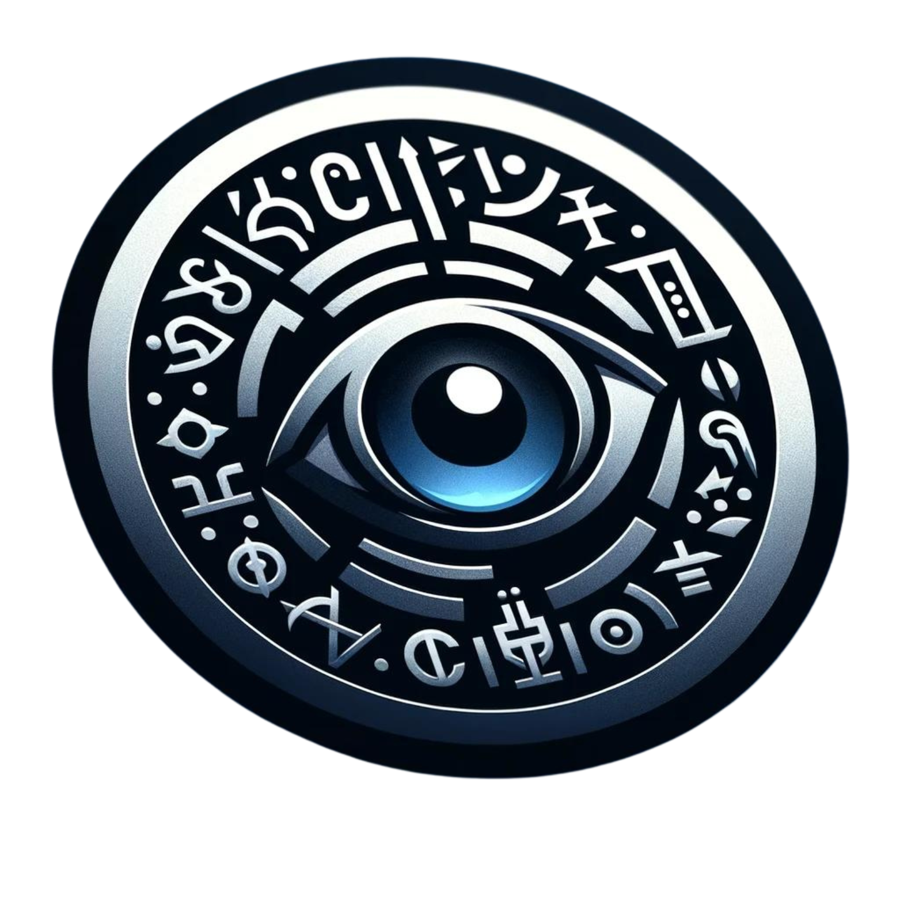

[](https://www.linkedin.com/in/rhyspostans/)
[](mailto:rmp71171@gmail.com)


## 🚀 About Me
With a rich tapestry of experience spanning law, business management, entrepreneurship, and coding, I am far from your typical software engineer. My legal training honed my meticulous problem-solving skills, while my studies in business management and Mandarin across Taiwan's dynamic landscapes enhanced my adaptability and cross-cultural expertise. Owning a business taught me to navigate precarious situations, transforming challenges into victories with a dash of creativity. More recently, my coding journey at the School of Code has ignited a fresh passion. I am thrilled to integrate these varied experiences into a vibrant career in software engineering, seamlessly merging fun and functionality in every line of code!

⚡️ Fun fact: The username I use on GitHub is actually a play on my full name, Rhys Montgomery Postans!


## 💡 Projects 
#### I love discussing my projects and welcome any questions about them, so feel free to ask!
<td>
    <a href="https://rhmopo.github.io/translator/" target="_blank">
        
    </a>
</td>
<td>
    <a href="https://rhmopo.github.io/phoneticGuesser2.0/" target="_blank">
        
    </a>
</td>

<table>
  <tr>
    <td>Name</td>
    <td>Description</td>
    <td>Why was it made?</td>
    <td>Tech used</td>
    <td>Status</td>
    

  </tr>
  <tr>
    <td><a href="https://rhmopo.github.io/phoneticGuesser2.0/" target="_blank">PHONETIC GUESSER</a><br></td>
    <td>Guess the word from its phonetic transcription. Use hints with dictionary definitions to help!</td>
    <td>This project began about three weeks into the School of Code. Initially, it wasn't designed as a formal project; rather, I simply wanted to experiment with some free APIs after learning how to make API calls using JavaScript. While examining the JSON response from a dictionary API, I noticed it included phonetics, which swiftly led to the creation of the basic concept for this game, where users are presented with a phonetic representation and must guess the corresponding word. Eager to avoid creating my own word database, I sought another API to automate the word generation process. Although this second API was not perfect due to compatibility issues between the two APIs, I managed to make it work. Additionally, this project became a valuable tool to implement and reinforce what I learned each week, helping to solidify my understanding and put my new skills into practice.<br><br> 

<details>
<summary>
What word is represented by the phonetic transcription [ɛɡˈzɑːmpl]? (Click to see answer)</summary>

**Answer:** ɛɡˈzɑːmpl = Example
</details></td>
    <td>
             <strong>Phonetic Guesser V.1</strong>: JavaScript, CSS3, HTML5, Node.js, Express.js, draw.io<br><br>
             <strong>Phonetic Guesser V.2</strong>: Next.js, React, JavaScript, Draw.io, Figma
    </td>
    <td>⏳ More functionality incoming...</td>      
  </tr>

  <tr>
    <td><a href="https://rhmopo.github.io/translator/" target="_blank">SECRET LANGUAGE TRANSLATOR</a></td>
    <td>This project involves a system designed to streamline the process of decoding messages that are written in a secret language I created with a friend.</td>
    <td>The main motivation for creating this project was the increasing amount of time it took to decode our growing encrypted chats. I wanted to continue enjoying the unique and private nature of our communication without the growing burden of manual decoding. By devising a secretive decoding method, I could maintain the enjoyment and pace of our conversations, ensuring that the fun of our secret language didn't turn into a chore.<br><br>*|```**_|*::|*_|_|*|```*_|```||*::**|::_|*_::|*|_|_|*_|```||**|_*|_|_|*_|```||*|```*_::|*_|```|*|```*|/\_|*|::_|**</td>
    <td>JavaScript, CSS3, HTML5</td>
    <td>✅ Completed</td>      
  </tr>
</table>


          


## 📲 Tools & Tech


          
## 🔮 Stats
[](https://github.com/ignacio-cuadra/github-readme-codewars)
[](https://git.io/streak-stats)  


